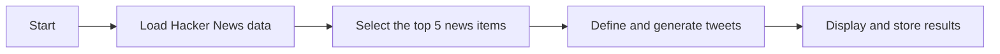

Claro, aquí tienes una versión simplificada del README en inglés, enfocada en los aspectos más importantes del proceso:

# Hacker News Analysis and Content Generation Project

## Description

This project focuses on the extraction, processing, and analysis of Hacker News articles. It also generates relevant content using natural language models. Through various techniques and tools, the project achieves the goal of obtaining, manipulating, and analyzing news data, as well as generating informative tweets about the news.

## Project Structure

The project is organized into several Python files and a Markdown file to keep a log of activities. Below is a high-level overview of the functionality and structure.

### Project Tree

```plaintext
C:.
|   .gitignore
|   poetry.lock
|   pyproject.toml
|   README.md
|
+---data
|       *.csv
|       *.html
|       tweets.csv
|
+---models
+---notebooks
|       ollama-test-01.py
|       testing-date-output.py
|       time-hour-function.py
|       twitter-conection.py
|       Vitacora.md
|
+---scripts
|       run_scripts.ps1
|
\---src
    date_today.txt
    hacker_news_scrapper.py
    hacker_news_table_extracter.py
```

## Installation and Usage

### Requirements

- Python 3.7 or higher
- Python libraries: `pandas`, `matplotlib`, `datetime`, `requests`, `beautifulsoup4`, `langchain_community`, `ollama`
- Other necessary packages can be installed using the provided `requirements.txt` file.

### Installation

1. Clone the repository:

    ```bash
    git clone https://github.com/username/hacker-news-project.git
    cd hacker-news-project
    ```

2. Install the dependencies:

    ```bash
    pip install -r requirements.txt
    ```

### Execution

To run the main script and generate tweets based on Hacker News articles:

```bash
python notebooks/ollama-test-01.py
```

## Flow Diagram



## Technical Details

### Data Extraction and Processing

The `hacker_news_scrapper.py` script uses web scraping techniques to obtain the most recent data from Hacker News. The data is then processed using `pandas` to filter and group by relevant metrics.

### Content Generation

The `Ollama` natural language model is used to generate tweets based on the news. Models are instantiated and prompts are formatted to produce coherent and relevant tweets.

## Example Output

Below is an example of the generated tweets:

```
Top 5 news:
1. Starting Hospice url: https://jakeseliger.com/2024/08/04/starting-hospice-the-end/
2. Google loses antitrust suit over search deals on phones url: https://www.bloomberg.com/news/articles/2024-08-05/google-loses-doj-antitrust-suit-over-search
3. Open Source Farming Robot url: https://farm.bot/
4. Launch HN: Airhart Aeronautics (YC S22) – A modern personal airplane url: item?id=41163382
5. How Postgres stores data on disk – this one's a page turner url: https://drew.silcock.dev/blog/how-postgres-stores-data-on-disk/

Generated tweets:
1. Here are three tweets discussing the impact of starting hospice:

Tweet 1:
As we navigate the complexities of end-of-life care, it's crucial to prioritize compassion and dignity. Starting hospice services can bring solace to those nearing the end of their journey, allowing them to focus on quality time with loved ones. #HospiceCare

Tweet 2:
The statistics are stark: many individuals are dying without access to adequate palliative care. By starting hospice early, we can ensure that patients receive the necessary support and comfort to live their remaining days with purpose and peace. #PalliativeCare

Tweet 3:
Imagine if our healthcare system prioritized quality over quantity of life. Starting hospice programs could revolutionize end-of-life care, allowing us to focus on the human experience rather than mere longevity. It's time for a shift in our approach. #HospiceRevolution
```

## Conclusion

This project provides a comprehensive solution for extracting, analyzing, and generating content based on Hacker News articles. Through the use of various data processing techniques and natural language models, it generates relevant and useful content for different audiences. We hope you find this project interesting and useful!

## Contact

For more information, questions, or contributions, please contact andresf.estrada.10@gmail.com

